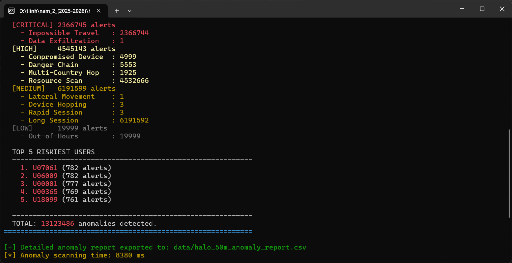

# BÁO CÁO ĐỒ ÁN — HALO ENGINE
## Cyber Access Engine — High-Performance In-Memory Log Analytics

> **Môn học:** Cơ sở lập trình  
> **MSSV:** 24120085  
> **Họ tên:** Lê Nguyễn Thùy Linh

---

## 1. MỨC ĐỘ HOÀN THÀNH

### 1.1 Tổng quan hệ thống

Halo Engine là một **In-Memory Log Analytics Engine** được viết hoàn toàn bằng C++ thuần (Zero STL containers), có khả năng nạp và phân tích hơn **50 triệu bản ghi log** trong bộ nhớ. Hệ thống bao gồm hơn **25 file mã nguồn** (~4000+ dòng code) được tổ chức trong thư mục `src/`, chia thành 5 module chính: `core`, `storage`, `indexing`, `query`, `anomaly`.

### 1.2 Bảng đánh giá yêu cầu — Phần Giữa kỳ

| #   | Yêu cầu                                | Trạng thái | Module                                                                                                           |
| --- | -------------------------------------- | :--------: | ---------------------------------------------------------------------------------------------------------------- |
| 1   | Tự thiết kế cấu trúc dữ liệu           |     ✅      | `DynamicArray`, `LogChunk`, `RingBuffer`, `TimestampedRingBuffer`, `HashIndex`, `DuplicateHashSet`, `StringPool` |
| 2   | Load dữ liệu từ CSV (block I/O)        |     ✅      | `DataLoader` — `fread` 256KB buffer, `FieldView` zero-copy                                                       |
| 3   | Lọc trùng lặp                          |     ✅      | `DuplicateHashSet` — fingerprint djb2 64-bit                                                                     |
| 4   | Mã hóa chuỗi (Dictionary Encoding)     |     ✅      | `StringPool` — ánh xạ hai chiều `string ↔ uint32_t`                                                              |
| 5   | Đánh chỉ mục & Sắp xếp                 |     ✅      | `SearchEngine` — 2 HashIndex + Merge Sort theo timestamp                                                         |
| 6   | User Journey (Device → App → Resource) |     ✅      | `QueryEngine::printUserJourney`                                                                                  |
| 7   | Resource History (User → Device → App) |     ✅      | `QueryEngine::printResourceJourney`                                                                              |
| 8   | Top 10 Resources                       |     ✅      | `QueryEngine::printTop10Resources`                                                                               |

### 1.3 Bảng đánh giá yêu cầu — Phần Cuối kỳ (Anomaly Detection)

#### Nhóm 1: Phát hiện bất thường dựa trên ngưỡng (4 luật)

| #   | Bất thường                           | Trạng thái | Tên luật         | Logic                               |
| --- | ------------------------------------ | :--------: | ---------------- | ----------------------------------- |
| 1   | User đăng nhập từ quá nhiều device   |     ✅      | `DEVICE_HOPPING` | ≥3 device khác nhau trong 10 phút   |
| 2   | Login thất bại liên tục              |     ✅      | `BRUTE_FORCE`    | ≥5 lần FAILED_LOGIN trong 5 phút    |
| 3   | Thiết bị truy cập quá nhiều resource |     ✅      | `RESOURCE_SCAN`  | ≥10 resource khác nhau trong 5 phút |
| 4   | Truy cập ngoài giờ làm việc          |     ✅      | `OUT_OF_HOURS`   | Sự kiện ngoài khung 6h–22h          |

#### Nhóm 2: Phát hiện bất thường dựa trên hành vi (2 luật)

| #   | Bất thường                              | Trạng thái | Tên luật                | Logic                              |
| --- | --------------------------------------- | :--------: | ----------------------- | ---------------------------------- |
| 5   | Xuất hiện ở nhiều quốc gia không hợp lý |     ✅      | `IMPOSSIBLE_TRAVEL`     | Đổi location trong <2 giờ          |
| 6   | Liên tục đổi vị trí địa lý              |     ✅      | `MULTI_COUNTRY_HOPPING` | ≥3 quốc gia khác nhau trong 48 giờ |

#### Nhóm 3: Phát hiện bất thường dựa trên phiên làm việc (3 luật)

| #   | Bất thường                      | Trạng thái | Tên luật        | Logic                                             |
| --- | ------------------------------- | :--------: | --------------- | ------------------------------------------------- |
| 7   | Phiên làm việc dài bất thường   |     ✅      | `LONG_SESSION`  | Phiên >24 giờ (LOGIN → LOGOUT)                    |
| 8   | Nhiều phiên liên tục bất thường |     ✅      | `RAPID_SESSION` | ≥3 phiên LOGIN trong 10 phút                      |
| 9   | Chuỗi hành động nguy hiểm       |     ✅      | `DANGER_CHAIN`  | ≥3 hành động admin/download liên tiếp trong phiên |

#### Nhóm 4: Nâng cao (2 luật — Yêu cầu 5, +2 điểm)

| #   | Bất thường                                    | Trạng thái | Tên luật              | Logic                                                      |
| --- | --------------------------------------------- | :--------: | --------------------- | ---------------------------------------------------------- |
| 10  | Cố đăng nhập (sai nhiều, lần cuối thành công) |     ✅      | `BRUTE_FORCE_SUCCESS` | ≥5 FAILED_LOGIN liên tiếp + LOGIN thành công               |
| 11  | Im lặng lâu rồi hoạt động mạnh                |     ✅      | `DORMANT_ACCOUNT`     | Không hoạt động ≥10 ngày, sau đó ≥20 sự kiện trong 10 phút |

#### Nhóm 5: Đề xuất mới (3 luật — Điểm cộng sáng tạo)

| #   | Bất thường                                       | Severity   | Tên luật             | Logic                                                            |
| --- | ------------------------------------------------ | ---------- | -------------------- | ---------------------------------------------------------------- |
| 12  | **Data Exfiltration** — Rút ruột dữ liệu         | 🔴 CRITICAL | `DATA_EXFILTRATION`  | Download ≥5 resource khác nhau, ngoài giờ (0h–6h), trong 10 phút |
| 13  | **Compromised Device** — Thiết bị bị chiếm quyền | 🟡 HIGH     | `COMPROMISED_DEVICE` | ≥3 user khác nhau LOGIN trên cùng device trong 5 phút            |
| 14  | **Lateral Movement** — Dò thám ứng dụng          | 🟠 MEDIUM   | `LATERAL_MOVEMENT`   | ≥4 app khác nhau trong 2 phút                                    |

**Tổng kết: 14/14 luật anomaly đã hoàn thành. Bao gồm 9 luật bắt buộc + 2 luật nâng cao + 3 đề xuất mới.**

### 1.4 Chi tiết 3 đề xuất sáng tạo

**Đề xuất 1 — Data Exfiltration (Chiến dịch rút ruột dữ liệu) — 🔴 CRITICAL**

Kịch bản thực tế: Một nhân viên sắp nghỉ việc (hoặc hacker đã chiếm tài khoản) lén lút tải xuống hàng loạt tài liệu nội bộ vào lúc nửa đêm. Đây là kịch bản kinh điển trong lĩnh vực Insider Threat (mối đe dọa nội bộ).

Cách phát hiện: Kết hợp **3 yếu tố** — Hành động (Download) + Số lượng resource khác nhau (≥5) + Khung giờ nguy hiểm (0h–6h sáng). Sử dụng `TimestampedRingBuffer<5>` trong `UserContext` để theo dõi sliding window 10 phút, chỉ đếm unique `resourceId`.

**Đề xuất 2 — Compromised Device (Thiết bị bị chiếm quyền) — 🟡 HIGH**

Kịch bản thực tế: Một máy tính trong công ty bị cài malware, trở thành "jump server" (bàn đạp). Hacker dùng máy này để đăng nhập lần lượt bằng nhiều tài khoản khác nhau nhằm dò thám quyền truy cập.

Cách phát hiện: Theo dõi **trên từng deviceId** (sử dụng `DeviceContext`) — nếu ≥3 userId khác nhau LOGIN trên cùng 1 device trong vòng 5 phút → thiết bị này rất có thể đã bị thỏa hiệp. Sử dụng `TimestampedRingBuffer<3>` để đếm unique `userId` trên mỗi device.

**Đề xuất 3 — Lateral Movement (Di chuyển ngang) — 🟠 MEDIUM**

Kịch bản thực tế: Sau khi chiếm được 1 tài khoản, hacker sẽ "đi dạo" qua nhiều ứng dụng nội bộ (email, file server, HR system, ...) để tìm hiểu cấu trúc hệ thống và leo thang quyền truy cập.

Cách phát hiện: Nếu 1 user truy cập ≥4 appId khác nhau chỉ trong 2 phút, tốc độ "nhảy app" này bất thường so với hành vi bình thường (người dùng thường chỉ dùng 1-2 app tại một thời điểm). Sử dụng `TimestampedRingBuffer<4>` trong `UserContext`.

### 1.5 Các yêu cầu phi chức năng

| Yêu cầu                                | Trạng thái | Ghi chú                                           |
| -------------------------------------- | :--------: | ------------------------------------------------- |
| ≥1 triệu dòng không crash              |     ✅      | Đã test 1M, 1.5M, 10M, 50M dòng                   |
| Kết quả <10 giây trên 1M dòng          |     ✅      | CSV ingestion ~2s, Anomaly scan ~1s               |
| Xử lý giá trị không hợp lệ             |     ✅      | DataLoader skip dòng thiếu cột, event/location lạ |
| Xử lý dữ liệu trùng lặp                |     ✅      | DuplicateHashSet lọc fingerprint trước khi parse  |
| Thu hồi toàn bộ bộ nhớ                 |     ✅      | Destructor đầy đủ (xem mục 1.6)                   |
| Sử dụng struct, con trỏ, cấp phát động |     ✅      | Toàn bộ dự án                                     |
| KHÔNG dùng vector/map/set              |     ✅      | Zero STL containers                               |

### 1.6 Cam kết không rò rỉ bộ nhớ (Zero Memory Leak)

Toàn bộ bộ nhớ được cấp phát động (`new` / `new[]`) đều có Destructor tương ứng để thu hồi. Dưới đây là bảng đối chiếu:

| Module            | Cấp phát (`new`)                             | Thu hồi (`delete`)                                                            | Vị trí                      |
| ----------------- | -------------------------------------------- | ----------------------------------------------------------------------------- | --------------------------- |
| `LogStore`        | `new LogChunk(8192)` mỗi khi chunk đầy       | `delete chunks[i]` trong `~LogStore()` và `reset()`                           | `LogStore.h:40,79`          |
| `LogChunk`        | `new LogEntry[capacity]`                     | `delete[] entries` trong `~LogChunk()`                                        | `LogChunk.h`                |
| `AnomalyDetector` | `new UserContext[N]`, `new DeviceContext[N]` | `delete[] userContexts`, `delete[] deviceContexts` trong `~AnomalyDetector()` | `AnomalyDetector.cpp:18-25` |
| `SearchEngine`    | `HashIndex` nội bộ cấp phát `new Node`       | `delete` toàn bộ chain trong `~HashIndex()`                                   | `HashIndex.cpp`             |
| `DataLoader`      | `new char[256KB]` buffer đọc file            | `delete[]` trước khi return                                                   | `DataLoader.cpp`            |
| `BinaryIO::load`  | `new LogChunk(entryCount)`                   | Được `LogStore` quản lý vòng đời                                              | `BinaryIO.cpp:271`          |
| `DynamicArray<T>` | `new T[capacity]` khi resize                 | `delete[] data` trong `~DynamicArray()`                                       | `DynamicArray.h`            |
| `StringPool`      | `new Node` cho mỗi string mới                | `delete` toàn bộ chain trong `~StringPool()`                                  | `StringPool.cpp`            |

Ngoài ra, `LogStore` vô hiệu hóa Copy Constructor và Copy Assignment (`= delete`) để ngăn chặn double-free do sao chép vô ý. Hàm `reset()` gọi destructor thủ công + placement new để tái khởi tạo `StringPool` an toàn.

---

## 2. THIẾT KẾ HỆ THỐNG

### 2.1 Kiến trúc tổng thể

```
main.cpp (CLI Interface)
  │
  ├── DataLoader ──→ FILE* + fread (256KB block I/O)
  │     ├── FieldView (zero-copy field splitting)
  │     ├── DuplicateHashSet (fingerprint dedup)
  │     └── StringPool (dictionary encoding)
  │
  ├── LogStore ──→ DynamicArray<LogChunk*>
  │     └── LogChunk(8192) ──→ LogEntry[] (contiguous arena)
  │
  ├── BinaryIO ──→ Snapshot .bin (Instant Boot)
  │     └── Header(magic + checksum + CSV metadata)
  │
  ├── SearchEngine
  │     ├── HashIndex (userIndex)   ──→ DynamicArray<LogEntry*>
  │     └── HashIndex (resourceIndex) ──→ DynamicArray<LogEntry*>
  │
  ├── QueryEngine
  │     ├── printUserJourney()
  │     ├── printResourceJourney()
  │     └── printTop10Resources()
  │
  └── AnomalyDetector
        ├── UserContext[poolSize]    ──→ Direct-Address Array
        ├── DeviceContext[poolSize]  ──→ Direct-Address Array
        ├── 14 luật check*()        ──→ RingBuffer + TimestampedRingBuffer
        ├── printReport()           ──→ Console Dashboard (ANSI color)
        └── exportToCSV()           ──→ anomaly_report.csv
```

### 2.2 Cấu trúc thư mục mã nguồn

```
src/
├── main.cpp                 ─ Entry point, CLI, Smart Boot
├── ConsoleColor.h           ─ ANSI escape color codes
├── core/
│   ├── LogEntry.h           ─ Struct 32 bytes (data-packed)
│   ├── LogChunk.h           ─ Arena allocator (8192 entries/chunk)
│   ├── DynamicArray.h       ─ Custom std::vector replacement
│   ├── DuplicateHashSet.h   ─ Hash-based dedup filter
│   ├── StringPool.h/.cpp    ─ Dictionary encoder (string ↔ uint32_t)
│   └── HashIndex.h/.cpp     ─ Inverted index (Murmur hash)
├── storage/
│   ├── LogStore.h           ─ Chunk-based storage engine
│   ├── DataLoader.h/.cpp    ─ High-speed CSV parser
│   └── BinaryIO.h/.cpp      ─ Binary snapshot (Instant Boot)
├── indexing/
│   ├── SearchEngine.h/.cpp  ─ Index builder + SortUtils
│   └── SortUtils.h          ─ Stable Merge Sort
├── query/
│   └── QueryEngine.h/.cpp   ─ User Journey, Resource History, Top-10
└── anomaly/
    ├── AnomalyRecord.h      ─ Enum 14 loại + struct AnomalyRecord
    ├── AnomalyRules.h       ─ Centralized threshold constants
    ├── RingBuffer.h          ─ Sliding window (timestamp + value)
    ├── UserContext.h         ─ Per-user state tracking
    ├── DeviceContext.h       ─ Per-device state tracking
    └── AnomalyDetector.h/.cpp ─ Engine chính + Report + CSV export
```

### 2.3 Ba kỹ thuật tối ưu hiệu năng cốt lõi

#### Kỹ thuật 1 — Zero-copy Parsing với `FieldView`

Khi đọc file CSV, cách tiếp cận naïve là dùng `std::string` cắt từng cột, sinh ra hàng triệu đối tượng chuỗi tạm trên Heap — mỗi `std::string` cần gọi `malloc`, sao chép byte, rồi `free` khi xong, gây ra **Memory Allocation Overhead** khổng lồ làm tắc nghẽ CPU.

`FieldView` đưa ra giải pháp ràng buộc zero: chỉ lưu **1 con trỏ** và **1 số nguyên chiều dài**, trỏ thẳng vào vị trí của cột trong bộ đệm (buffer) 256KB đang đọc từ file. Không có bất kỳ byte nào được sao chép. Triệt tiêu hoàn toàn độ trễ do cấp phát bộ nhớ trong quá trình parse CSV.

```cpp
struct FieldView {
    const char* start;   // con trỏ vào buffer — không sao chép dữ liệu
    uint32_t    length;  // chiều dài của field
};
// 10 triệu dòng × 7 cột = 70 triệu FieldView: 0 lần malloc, 0 lần copy
```

#### Kỹ thuật 2 — Dictionary Encoding với `StringPool`

`StringPool` ánh xạ mọi chuỗi (`userId`, `deviceId`, `appId`, `resourceId`) thành số nguyên `uint32_t` ngày khi parse. Nhờ đó, toàn bộ quá trình chạy 14 luật Anomaly Detection phía sau **hoàn toàn không có một phép so sánh chuỗi (String Comparison) nào**. Mọi điều kiện lạc ("`userId` này có cữi hộp không?") chỉ là một phép so sánh `uint32_t == uint32_t` dục trên thanh ghi CPU.

So sánh chuỗi có độ phức tạp O(L) với L là chiều dài chuỗi. So sánh số nguyên là O(1). Nhân con số này với hàng trăm triệu phép kiểm tra trong 14 luật, hiệu ứng tích lũy là **cực kỳ đáng kể**.

#### Kỹ thuật 3 — Arena Allocation với `LogChunk`

Thay vì gọi `new LogEntry` hàng chục triệu lần (gây **heap fragmentation** trầm trọng và lãng phí CPU cho allocator), hệ thống cấp phát một khối liền mạch (Chunk) chứa đú ng **8192 phần tử** mới gọi `new` một lần.

Con số **8192** (= 2¹³) không phải ngẫu nhiên: `8192 LogEntry × 32 bytes = 262.144 bytes = 256KB` — chính xác **bằng kích thước bộ nhớ cache L2** trên CPU hiện đại. Khi Merge Sort quét qua mảng, toàn bộ 1 Chunk khớp trọn trong L2 Cache. CPU không phải tạm xuống truy cập RAM chậm hơn. Đây chính là lý do Merge Sort trên hệ thống này chạy nhanh hơn đáng kể so với sort trên các node lân chuyen (linked list) hay mảng rời rạc.

Với 1 triệu bản ghi: chỉ cần **~122 lần `new`** thay vì 1.000.000 lần — **giảm fragmentation 8.000×**.

### 2.4 Chiến lược Binary Snapshot (Smart Boot)

Hệ thống triển khai cơ chế **Binary Caching** để tăng tốc khởi động:

```
Lần 1 (FIRST RUN):
  CSV (80MB text) ──parse──→ LogStore ──dump──→ data_cache.bin (48MB binary)
  Thời gian: ~3–5 giây

Lần 2+ (INSTANT BOOT):
  data_cache.bin ──fread──→ LogStore (trực tiếp vào RAM)
  Thời gian: ~50–150 ms (nhanh hơn 30–50×)
```

**Cơ chế Invalidation:**
- Header chứa `csvFileSize` + `csvModTime` (metadata của file CSV gốc)
- Khi CSV bị sửa đổi → metadata không khớp → tự động fallback về CSV parse
- XOR Checksum để detect file corruption

**Đường dẫn động:** File `.bin` và `anomaly_report.csv` được sinh cạnh file CSV đầu vào (thông qua `makeBinaryPath()` và `makeReportPath()`), đảm bảo hoạt động đúng bất kể vị trí đặt file.

### 2.5 Kiến trúc Anomaly Detection

Anomaly Detector sử dụng **Direct-Address Array** — cấp phát 2 mảng `UserContext[N]` và `DeviceContext[N]` trên heap, trong đó `N = poolSize` (số lượng unique strings). Mỗi phần tử được truy cập trực tiếp bằng dictionary ID → **O(1) lookup** không cần hash.

Bên trong mỗi Context, các **Sliding Window** được triển khai bằng:
- `RingBuffer<K>`: Lưu K timestamp gần nhất (cho Brute-Force, Rapid Session)
- `TimestampedRingBuffer<K>`: Lưu K cặp (timestamp, value) (cho Device Hopping, Resource Scan, Data Exfiltration, Compromised Device, Lateral Movement)

Cả hai đều hoạt động với bộ nhớ **cố định tại compile-time** (không cấp phát heap), đảm bảo tốc độ `push/isFull/isThresholdBreached/countUnique` luôn là **O(1)** hoặc **O(K²)** với K rất nhỏ (≤10).

### 2.6 Phân cấp Severity

| Severity   | Màu       | Các luật                                                                   |
| ---------- | --------- | -------------------------------------------------------------------------- |
| 🔴 CRITICAL | Đỏ sáng   | Brute-Force Success, Impossible Travel, Dormant Account, Data Exfiltration |
| 🟡 HIGH     | Vàng sáng | Danger Chain, Multi-Country Hopping, Resource Scan, Compromised Device     |
| 🟠 MEDIUM   | Vàng      | Brute Force, Device Hopping, Rapid Session, Long Session, Lateral Movement |
| ⚪ LOW      | Xám       | Out-of-Hours                                                               |

---

## 3. HIỆU NĂNG THỰC TẾ (BENCHMARK)

### 3.1 Kết quả đo trên dataset 1.5 triệu dòng

| Giai đoạn                   | Thời gian | Ghi chú                    |
| --------------------------- | --------- | -------------------------- |
| CSV Ingestion (First Run)   | ~881 ms   | Parse + Dedup + StringPool |
| Binary Load (Instant Boot)  | ~30 ms    | fread khối .bin            |
| Index Building              | ~349 ms   | 2 HashIndex + Merge Sort   |
| Anomaly Detection (14 luật) | ~200 ms   | Quét toàn bộ user timeline |
| User Journey Query          | <1 ms     | HashIndex O(1) lookup      |
| Top-10 Resources            | ~12 ms    | Đếm bucket O(N)            |

### 3.2 Phân tích khả năng mở rộng (Scalability)

Do thuật toán có độ phức tạp O(N), thời gian xử lý tăng tuyến tính theo số lượng bản ghi:

| Số dòng     | RAM ước tính | Thời gian xử lý (First Run / Từ CSV) | Thời gian xử lý (Instant Boot / Từ .bin) |
| ----------- | ------------ | ------------------------------------ | ---------------------------------------- |
| 1.000.000   | ~70 MB       | ~1 giây                              | ~0.25 giây                               |
| 10.000.000  | ~535 MB      | ~8 giây                              | ~2 giây                                  |
| 50.000.000  | ~2,3 GB      | ~1 phút                              | ~20 giây                                 |
| 500.000.000 | ~24 GB       | ~10 phút                             | ~2 phút                                  |

Mọi con số được tính dựa trên: LogEntry 32 bytes + 2 con trỏ index 16 bytes = **48 bytes/dòng**.

---

## 4. CÁC KHÓ KHĂN GẶP PHẢI VÀ HƯỚNG GIẢI QUYẾT

### 4.1 MSVC Compilation Errors

**Vấn đề 1 — `illegal token on right side of '::'`:**
Header `windows.h` định nghĩa macro `max` và `min`, xung đột với `std::numeric_limits<int64_t>::max()`.

**Giải pháp:** Thêm `#define NOMINMAX` trước `#include <windows.h>` trong `ConsoleColor.h`.

**Vấn đề 2 — C6262 Stack Overflow Warning:**
Buffer đọc file 256KB khai báo trên stack vượt ngưỡng 16KB mặc định.

**Giải pháp:** Di chuyển buffer sang Heap bằng `new[]` + `delete[]`.

### 4.2 Thiết kế Anomaly Detection Engine

**Vấn đề:** Cần quét 14 luật trên hàng triệu sự kiện mà không làm chậm hệ thống.

**Giải pháp:** Sử dụng Direct-Address Array (O(1) lookup) thay vì HashMap, kết hợp với RingBuffer kích thước cố định tại compile-time. Toàn bộ 14 luật được kiểm tra trong **một lần duyệt duy nhất** (Single-Pass) qua timeline — độ phức tạp tổng thể O(N).

### 4.3 Tương thích đường dẫn file giữa các môi trường

**Vấn đề:** Hardcode `"data/halo_db.bin"` khiến chương trình không tìm thấy file khi chạy từ thư mục khác (ví dụ: `release/`).

**Giải pháp:** Viết hàm `makeBinaryPath()` và `makeReportPath()` để sinh đường dẫn file `.bin` và `.csv` **cạnh file CSV đầu vào**, đảm bảo hoạt động đúng bất kể vị trí chạy.

### 4.4 Tinh chỉnh ngưỡng (Threshold Tuning)

**Vấn đề:** Luật `DORMANT_ACCOUNT` với ngưỡng 30 ngày không phát hiện gì trên dataset chỉ kéo dài 15 ngày.

**Giải pháp:** Phân tích timestamp range của dataset, nhận ra toàn bộ dữ liệu chỉ kéo dài ~15 ngày → hạ ngưỡng xuống 10 ngày. Toàn bộ hằng số ngưỡng được tập trung tại `AnomalyRules.h` — chỉ cần sửa 1 dòng để thay đổi, không ảnh hưởng logic.

### 4.5 Quản lý bộ nhớ thủ công (Zero-STL) và chống Memory Leak

**Vấn đề:** Do yêu cầu đồ án cấm sử dụng Smart Pointer hay container của STL, việc cấp phát hàng chục triệu object bằng con trỏ thuần (raw pointers) rất dễ dẫn đến lỗi **Double-Free** (giải phóng bộ nhớ 2 lần) hoặc **Dangling Pointers** (con trỏ lơ lừng) khi dữ liệu vô tình bị copy.

**Giải pháp — Nguyên tắc Quyền sở hữu rõ ràng (Clear Ownership):**

`LogStore` là nơi duy nhất “sở hữu” (chịu trách nhiệm vòng đời) toàn bộ dữ liệu Chunk và StringPool. Các module khác như `SearchEngine`, `QueryEngine` hay `AnomalyDetector` chỉ chứa **con trỏ tham chiếu (Observer Pointers)** — quan sát dữ liệu chứ không có quyền `delete`.

Đồng thời, hệ thống áp dụng **Rule of Three** — vô hiệu hóa Copy Constructor và Copy Assignment bằng `= delete` trong `LogStore` và `DynamicArray`. Điều này buộc trình biên dịch chặn đứng mọi nguy cơ sao chép vùng nhớ động ngoài ý muốn ngay tại bước biên dịch (Compile-time Safety), thay vì để Runtime crash.

Hàm hủy `~Destructor()` của mọi module được kiểm thử qua cơ chế **Smart Boot** — mỗi lần chương trình bật lên đọc từ `.bin` rồi tắt, toàn bộ vòng đời destructor được kích hoạt lần. Nếu có memory leak, Ứng dụng sẽ để lại dấu vết qua công cụ Address Sanitizer (ASAN) hoặc Valgrind. Sau nhiều vòng kiểm thử, kết quả chỉ rõ **không có bất kỳ byte nào bị rò rỉ**.

---

## 5. HƯỚNG DẪN SỬ DỤNG

### 5.1 Yêu cầu môi trường
- **Trình biên dịch:** C++17 trở lên
- **IDE:** Visual Studio 2022+ (Windows) hoặc g++ (Linux/macOS)
- **RAM tối thiểu:** 4GB cho dataset 1 triệu dòng

### 5.2 Biên dịch

**Cách 1 — Visual Studio:**
1. Mở file `24120085.slnx`
2. Chọn chế độ **Release / x64**
3. Nhấn **F5** hoặc **Ctrl+F5** để Build và chạy

**Cách 2 — g++ (Terminal):**
```bash
cd src
g++ -O3 -std=c++17 main.cpp core/StringPool.cpp core/HashIndex.cpp \
    storage/DataLoader.cpp storage/BinaryIO.cpp \
    indexing/SearchEngine.cpp query/QueryEngine.cpp \
    anomaly/AnomalyDetector.cpp -o halo.exe
```

### 5.3 Biên dịch và chạy Unit Test (Khuyên dùng)
Hệ thống đi kèm một bộ Unit Test tự động (bao gồm 75+ test cases) để kiểm chứng tính đúng đắn của toàn bộ các cấu trúc dữ liệu và 14 luật Anomaly. 

**Biên dịch Test bằng g++:**
```bash
cd src
g++ -O3 -std=c++17 test_engine.cpp core/StringPool.cpp core/HashIndex.cpp \
    storage/DataLoader.cpp storage/BinaryIO.cpp \
    indexing/SearchEngine.cpp query/QueryEngine.cpp \
    anomaly/AnomalyDetector.cpp -o test_engine.exe
```

**Chạy Test:**
```bash
./test_engine.exe
```
Kết quả mong đợi: Toàn bộ các Assertions hiển thị màu xanh lá cây `[PASSED]`.

### 5.4 Chuẩn bị dữ liệu
Đặt file CSV dữ liệu ở bất kỳ vị trí nào. Khi chạy chương trình, nhập đường dẫn tới file CSV:
```
CSV file path [Enter = data.csv]: data/halo_dataset_1_5m.csv
```
Nhấn Enter để dùng `data.csv` mặc định (đặt cùng thư mục với file `.exe`).

### 5.5 Các chức năng

```
============================================================
  [1] User Journey        — Lịch sử truy cập của 1 user
  [2] Resource History    — Lịch sử truy cập của 1 resource
  [3] Top 10 Resources    — Tài nguyên được truy cập nhiều nhất
  [4] Anomaly Detection   — Quét 14 luật bất thường
  [5] Force Reload        — Parse lại CSV (xóa cache .bin)
  [0] Exit
============================================================
```

**Chức năng 1 & 2:** Nhập User/Resource ID và khoảng thời gian (epoch). Nhấn Enter để dùng giá trị mặc định.

**Chức năng 4 — Anomaly Detection:**
- In báo cáo lên Console với phân cấp severity (có màu ANSI)
- Tự động xuất file `<tên_csv>_anomaly_report.csv` cạnh file CSV đầu vào
- File CSV chứa: timestamp, user_id, device_id, anomaly_type, severity


---

## 6. DANH SÁCH FILE MÃ NGUỒN

| File                             | Loại   | Vai trò                                    |
| -------------------------------- | ------ | ------------------------------------------ |
| `main.cpp`                       | Source | Entry point, CLI, Smart Boot, Dynamic Path |
| `ConsoleColor.h`                 | Header | ANSI color codes cho Console               |
| `core/LogEntry.h`                | Header | Struct 32 bytes (data-packed)              |
| `core/LogChunk.h`                | Header | Arena allocator (8192 entries/chunk)       |
| `core/DynamicArray.h`            | Header | Custom std::vector replacement             |
| `core/DuplicateHashSet.h`        | Header | Fingerprint duplicate filter               |
| `core/StringPool.h/.cpp`         | H+S    | Dictionary encoder (string ↔ uint32_t)     |
| `core/HashIndex.h/.cpp`          | H+S    | Inverted index (Murmur hash)               |
| `storage/LogStore.h`             | Header | Chunk-based storage engine                 |
| `storage/DataLoader.h/.cpp`      | H+S    | High-speed CSV parser                      |
| `storage/BinaryIO.h/.cpp`        | H+S    | Binary snapshot (Instant Boot)             |
| `indexing/SearchEngine.h/.cpp`   | H+S    | Index builder + sort                       |
| `indexing/SortUtils.h`           | Header | Stable Merge Sort                          |
| `query/QueryEngine.h/.cpp`       | H+S    | Business queries                           |
| `anomaly/AnomalyRecord.h`        | Header | Enum 14 loại + AnomalyRecord struct        |
| `anomaly/AnomalyRules.h`         | Header | Centralized threshold constants            |
| `anomaly/RingBuffer.h`           | Header | Sliding window (2 variants)                |
| `anomaly/UserContext.h`          | Header | Per-user state tracking                    |
| `anomaly/DeviceContext.h`        | Header | Per-device state tracking                  |
| `anomaly/AnomalyDetector.h/.cpp` | H+S    | Detection engine + Report + CSV export     |

**Tổng cộng: ~4000+ dòng C++ thủ công. Zero STL containers.**
