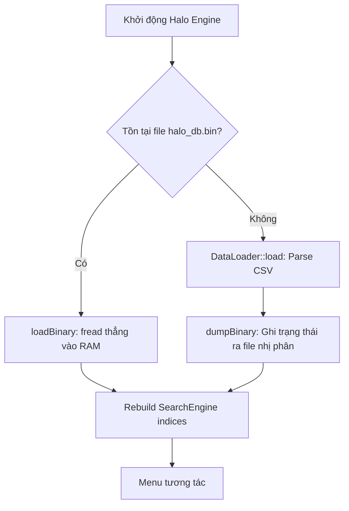

# Phase 3: Binary Serialization (Dump / Load)

## Mục tiêu

Cho phép hệ thống **lưu lại trạng thái đã xử lý** (pre-processed state) sau lần chạy đầu tiên. Ở những lần chạy tiếp theo, thay vì parse CSV lại từ đầu (tốn ~2-5 giây cho 10M rows), hệ thống sẽ **đọc thẳng file nhị phân** (binary) vào RAM trong **~50ms** — tăng tốc **40-100×** thời gian khởi động.

### Luồng hoạt động mới



---

## Phân tích: Cái gì cần serialize?

| Component | Cần dump? | Lý do |
|---|---|---|
| **StringPool** (slots + strings) | ✅ Có | Chứa toàn bộ dictionary encoding. Không dump = mất hết tên user/device/app |
| **LogStore** (chunks → LogEntry[]) | ✅ Có | Chứa toàn bộ log data đã dictionary-encoded |
| **DuplicateHashSet** | ❌ Không | Chỉ dùng trong quá trình ingestion CSV. Khi load binary, không cần dedup |
| **SearchEngine / HashIndex** | ❌ Không | Rebuild từ LogStore rất nhanh (~200ms). Serialize sẽ phức tạp hóa vô ích vì chứa con trỏ runtime |

> [!IMPORTANT]
> **SearchEngine KHÔNG được serialize** vì nó lưu `const LogEntry*` — đây là con trỏ runtime, sẽ invalid khi load lại. Thay vào đó, ta rebuild lại indices sau khi load binary (chỉ mất ~200ms).

---

## Thiết kế định dạng file nhị phân (`halo_db.bin`)

### Layout tổng quan

```
┌─────────────────────────────────────┐
│  File Header (32 bytes)             │
├─────────────────────────────────────┤
│  Section 1: StringPool Dictionary   │
│    - stringCount (4 bytes)          │
│    - For each string:               │
│        strLength (4 bytes)          │
│        strData   (strLength bytes)  │
├─────────────────────────────────────┤
│  Section 2: Log Data                │
│    - totalEntries (8 bytes)         │
│    - chunkCount   (4 bytes)         │
│    - For each chunk:                │
│        entryCount  (4 bytes)        │
│        minTimestamp (8 bytes)        │
│        maxTimestamp (8 bytes)        │
│        entries[]  (entryCount × 32) │
└─────────────────────────────────────┘
```

### File Header (32 bytes)

```c
struct BinaryHeader {
    char     magic[4];       // "HALO" — Magic Number để validate
    uint32_t version;        // 1 — Schema version
    uint64_t totalEntries;   // Tổng số LogEntry
    uint32_t chunkCount;     // Số lượng chunks
    uint32_t stringCount;    // Số lượng unique strings trong StringPool
    uint64_t checksum;       // XOR checksum toàn bộ entries để detect corruption
};
```

> [!NOTE]
> **Tại sao cần checksum?** Nếu file bị hỏng (partial write, disk error), hệ thống sẽ phát hiện và fallback về CSV parsing tự động.

### LogEntry serialization

`LogEntry` là **POD struct** (Plain Old Data) — có thể `fwrite` / `fread` nguyên khối mà không cần serialize từng field. Kích thước cố định: **32 bytes** (do padding).

```cpp
// Dump: Ghi toàn bộ mảng entries[] trong 1 lệnh fwrite duy nhất
fwrite(chunk->raw(), sizeof(LogEntry), chunk->size(), file);

// Load: Đọc lại nguyên khối
fread(chunk->raw(), sizeof(LogEntry), entryCount, file);
```

> [!TIP]
> Đây là lợi thế cực lớn của thiết kế POD + dictionary encoding. Nếu LogEntry chứa `std::string`, ta không thể fwrite nguyên khối được.

---

## Proposed Changes

### Serialization Module

#### [NEW] [BinaryIO.h](file:///d:/tlinh/nam_2_(2025-2026)/hk2/CSLT/TH/project/24120085/src/storage/BinaryIO.h)

Class `BinaryIO` với 2 static methods:

```cpp
class BinaryIO {
public:
    /**
     * @brief Dump toàn bộ LogStore + StringPool ra file nhị phân.
     * Luồng: Header → StringPool strings → LogChunk entries
     */
    static bool dump(const char *filepath, const LogStore &store);

    /**
     * @brief Load file nhị phân ngược lại vào LogStore + StringPool.
     * Luồng: Validate header → Restore strings → Restore chunks
     */
    static bool load(const char *filepath, LogStore &store);
};
```

**Thuật toán `dump()`:**
1. Ghi `BinaryHeader` (32 bytes)
2. Ghi StringPool:
   - `stringCount` (4 bytes)
   - Cho mỗi string: `length` (4 bytes) + `data` (N bytes)
3. Ghi Log Data:
   - Cho mỗi chunk: `entryCount` + `minTimestamp` + `maxTimestamp` + fwrite nguyên khối `entries[]`
4. Seek lại header, cập nhật checksum

**Thuật toán `load()`:**
1. Đọc + validate `BinaryHeader` (check magic "HALO", version, checksum)
2. Đọc StringPool:
   - Đọc `stringCount`, pre-allocate
   - Đọc từng string → gọi `stringPool.getOrCreateId()`
3. Đọc Log Data:
   - Đọc metadata từng chunk → allocate LogChunk → fread nguyên khối entries[]
4. Verify checksum

---

### LogStore Changes

#### [MODIFY] [LogStore.h](file:///d:/tlinh/nam_2_(2025-2026)/hk2/CSLT/TH/project/24120085/src/storage/LogStore.h)

Thêm 1 method mới để BinaryIO có thể inject chunks trực tiếp:

```cpp
// Cho phép BinaryIO inject chunk đã được populate sẵn
void addLoadedChunk(LogChunk *chunk, uint32_t entryCount);
```

---

### LogChunk Changes

#### [MODIFY] [LogChunk.h](file:///d:/tlinh/nam_2_(2025-2026)/hk2/CSLT/TH/project/24120085/src/core/LogChunk.h)

Thêm setter cho metadata timestamp (dùng khi load binary):

```cpp
// Cho phép BinaryIO restore timestamp metadata khi load
void setTimestampRange(int64_t min, int64_t max);

// Cho phép BinaryIO set count sau khi fread nguyên khối
void setCount(uint32_t c);
```

---

### Main Integration

#### [MODIFY] [main.cpp](file:///d:/tlinh/nam_2_(2025-2026)/hk2/CSLT/TH/project/24120085/src/main.cpp)

Thay đổi luồng khởi động:

```cpp
const std::string BINARY_PATH = "halo_db.bin";

// Thử load binary trước
bool loaded = BinaryIO::load(BINARY_PATH.c_str(), store);

if (!loaded) {
    // Fallback: parse CSV như cũ
    loaded = DataLoader::load(csvFilename, store, gatekeeper);

    if (loaded) {
        // Lần đầu thành công → dump binary cho lần sau
        BinaryIO::dump(BINARY_PATH.c_str(), store);
        std::cout << "[+] Binary snapshot saved: " << BINARY_PATH << "\n";
    }
}

// SearchEngine rebuild (luôn cần chạy lại)
engine.buildIndices(store);
```

---

## Open Questions

> [!IMPORTANT]
> **1. Tên file nhị phân:** Dùng cố định `halo_db.bin` hay cho phép user chọn? Hiện tại plan dùng tên cố định để đơn giản.

> [!IMPORTANT]
> **2. Invalidation:** Khi file CSV bị sửa đổi (thêm dòng mới), file `halo_db.bin` sẽ lỗi thời (stale). Bạn muốn:
> - **(A)** So sánh file size / modification time của CSV vs binary để auto-invalidate?
> - **(B)** Thêm option trong menu "Force reload from CSV" để user tự chọn?
> - **(C)** Cả A và B?

---

## Verification Plan

### Automated Tests
1. **Build & Run**: Biên dịch toàn bộ project, chạy với file `data.csv`
2. **Round-trip Test**: 
   - Load CSV → dump binary → exit
   - Load binary → so sánh `store.size()`, `stringPool.size()` với lần 1
   - Chạy query User Journey và Resource Journey → kết quả phải giống hệt
3. **Corruption Test**: Sửa 1 byte trong `halo_db.bin` → hệ thống phải reject và fallback CSV
4. **Performance Benchmark**: So sánh thời gian khởi động CSV vs Binary

### Manual Verification
- Xóa file `halo_db.bin` → hệ thống phải tự parse CSV và tạo lại file binary
- Sửa file `data.csv` → nếu chọn option A, hệ thống phải phát hiện và re-parse

### Kỳ vọng Performance

| Metric | CSV (hiện tại) | Binary (Phase 3) |
|---|---|---|
| Load time (10M rows) | ~2000 ms | **~50 ms** |
| File size | ~500 MB | **~320 MB** (sau dictionary encoding) |
| CPU usage khi load | Cao (parse + hash) | **Gần 0%** (chỉ fread) |
